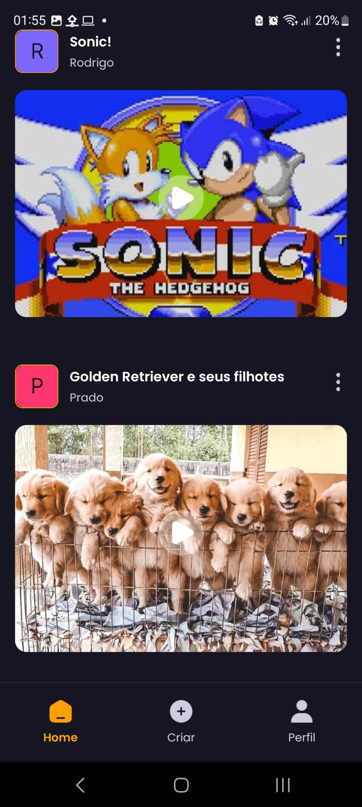
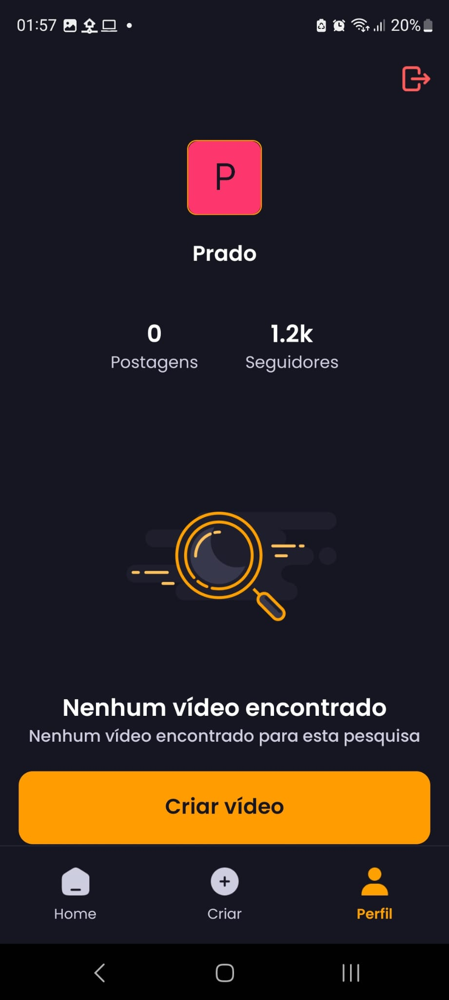
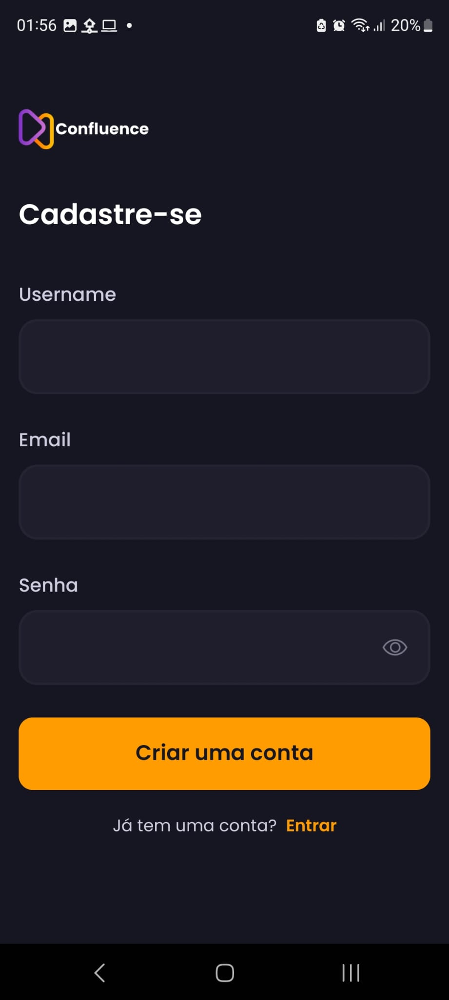

<div style="text-align: center;">
  <h1>Confluence: Aplicativo React Native Full Stack</h1>
  
</div>

O Confluence é uma plataforma de compartilhamento de vídeos desenvolvida em React Native, com foco na entrega de uma experiência de usuário refinada e imersiva em dispositivos móveis. os usuários podem fazer upload de seus próprios vídeos ou assistir aos vídeos de outras pessoas. Qualquer pessoa pode se tornar um criador de conteúdo no Confluence, fazendo upload de vídeos para compartilhar com outros usuários.


## Funcionalidades do Projeto

- **Sistema de Autenticação e Autorização Seguro:** Login seguro por e-mail para proteção das contas.
- **Tela inicial interativa com lista animada:** Uma lista dinâmica e suavemente animada apresenta os vídeos mais recentes, proporcionando uma experiência de navegação fluida.

 - **Funcionalidade Pull-to-Refresh:** Os usuários podem atualizar o conteúdo com um simples gesto de puxar para obter informações atualizadas.

- **Capacidade de busca de texto completo:** pesquise vídeos de forma eficiente com resultados instantâneos.

- **Navegação por guias:** navegue entre seções como Página inicial, Pesquisa e Perfil com facilidade usando a navegação por guias.

- **Tela de upload de mídia:** Envie vídeos e imagens diretamente do aplicativo com integração de seleção de mídia.

- **Tela de perfil com informações detalhadas:** visualize detalhes e atividades da conta, incluindo vídeos enviados e contagem de seguidores, para uma experiência personalizada.

- **Responsividade:** Desempenho fluido e adaptação em diversos dispositivos e tamanhos de tela para uma experiência de usuário consistente.

- **Animações:** Elementos dinâmicos animados utilizando a biblioteca Animatable para melhorar a interação e engajamento do usuário em toda a interface do aplicativo.

Além disso, o aplicativo oferece uma variedade de outras funcionalidades, incluindo arquitetura de código bem planejada e capacidade de reutilização de componentes para facilitar o desenvolvimento e a manutenção do projeto.

## Tecnologias Utilizadas

- React Native
- Expo
- Nativewind
- Animatable
- Appwrite

## Layout

Abaixo, você pode ver algumas capturas de tela das principais telas do Confluence:

#### Tela Inicial

<div>
  
  
</div>

#### Tela de Upload de Mídia

<div>
  
</div>

### Tela de Perfil

<div>
  
</div>

### Tela de Login e Cadastro

<div>
  
  
</div>

## Demonstração

Confira o funcionamento do aplicativo neste vídeo demonstrativo: 

[](./confluence-mobile/assets/telas/demonstracao.mp4)

## Instalação

Siga estas etapas para configurar o projeto localmente em sua máquina.

Pré-requisitos

Certifique-se de ter instalado em sua máquina:

- [Git](https://git-scm.com/)
- [Node.js](https://nodejs.org/)
- [npm](https://www.npmjs.com/)

Clonando o Repositório: 

```bash
git clone git@github.com:rpfigueiredo/react-native-confluence-app.git
```

Instalação:

```bash
npm install
```

Executando o Projeto:

```bash
npm start
```

Baixe o aplicativo Expo Go em seu dispositivo móvel e utilize-o para escanear o código QR exibido no terminal.

